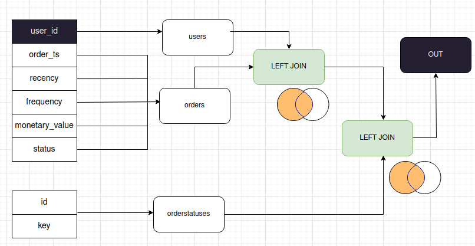
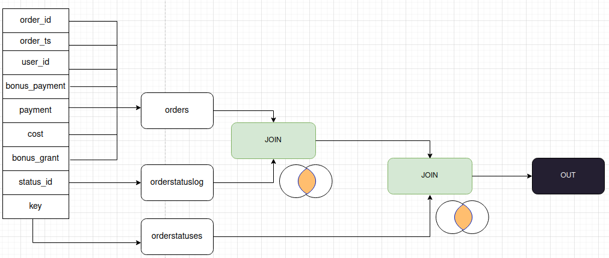

## 1.2. Изучите структуру исходных данных.

1. Данные таблицы **production.users** нужно соединить с данными таблицы **production.orders** с помощью LEFT JOIN, поскольку пользователь мог не оформить ни одного заказа за интересующий временной интервал.

   Полученный результат нужно соединить с таблицей **production.orderstatuses** с помощью LEFT JOIN. В **production.orderstatuses** в поле key хранится наименование статуса.

   Диаграмма представлена в **diagrams/schema_part1.png**

   

2. В таблице **production.orderstatuslog** для каждого заказа нужно найти его актуальный статус по последней дате. 

   Затем полученное множество соединяется с **production.orders** с помощью JOIN.

   Наконец, для получения наименования статуса заказа полученное множество нужно соединить с **production.orderstatuses**  с помощью JOIN.

   Полученная выборка - новое представление **analysis.orders**.

   Диаграмма представлена в **diagrams/orders_view.png**

   
