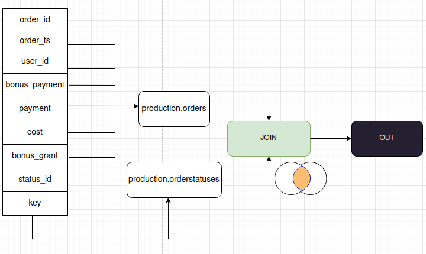
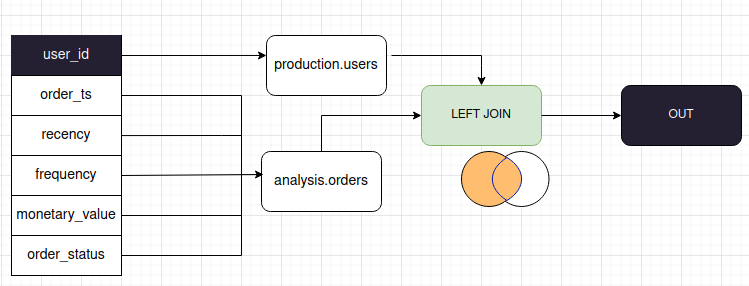
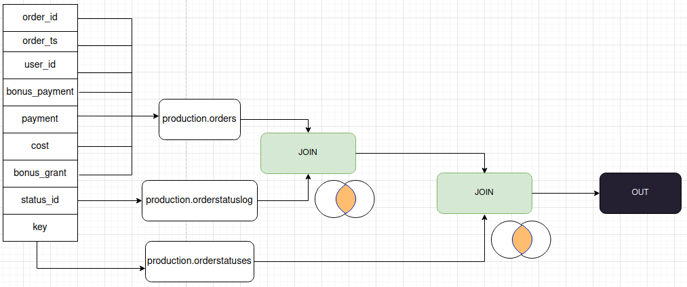

## 1.2. Изучите структуру исходных данных.

1. Для построения представления **analysis.Orders** данные таблицы **production.orders** нужно соединить с таблицей **production.orderstatuses** с помощью JOIN. В **production.orderstatuses** в поле key хранится наименование статуса.

   Диаграмма представлена в **diagrams/order_view_part1.png**.

   

2. Данные таблицы **production.users** нужно соединить с данными таблицы **analysis.orders** с помощью LEFT JOIN, поскольку пользователь мог не оформить ни одного заказа за интересующий временной интервал.

   Диаграмма представлена в **diagrams/schema.png**.

   

3. В таблице **production.orderstatuslog** для каждого заказа нужно найти его актуальный статус по последней дате. 

   Затем полученное множество соединяется с **production.orders** с помощью JOIN.

   Наконец, для получения наименования статуса заказа полученное множество нужно соединить с **production.orderstatuses**  с помощью JOIN.

   Поскольку запросы используют данные представления **analysis.orders**, то их код менять не нужно.

   Полученная выборка - новое представление **analysis.orders**.

   Диаграмма представлена в **diagrams/orders_view_part2.png**.

   
